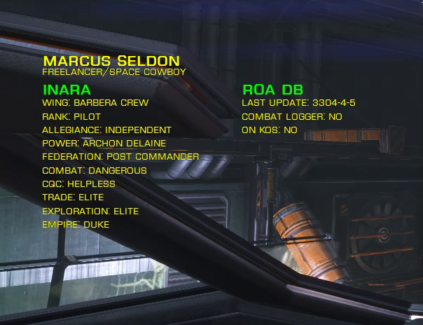

# OmniScanner
An EDMC plugin for scanning commanders and getting their background info.

## About
OmniScanner is a plugin for scanning commanders and get their background profiles from [Inara][0] and from the [Ronin of Amarak (ROA) PVP Database][1].

## Usage
OmniScanner works only when another player is scanned (obviously), after the scan is complete you will receive any info found on Inara or on ROA DB.

**Only open mode is supported**, this plugin deactivate itself in **solo** for obvious reasons and **private groups are not supported** (at least for now).

An example response:

## Installation
- Run the the installer for the latest version.
- If you are installing OmniScanner for the first time you need to authorize `EDMCOverlay.exe` by running it from desktop at this location: `C:\Users\%USERPROFILE%\AppData\Local\EDMarketConnector\plugins\OmniScanner\EDMCOverlay\EDMCOverlay.exe`
- Restart ED Market Connector and pray the [Great Attractor][2].

### Note for EDMCOverlay
[EDMCOverlay][3] is an unsigned program so you need to "trust" it before running it, you can change its trust policies either by running it or using the file properties dialog.

## Compatibility
- Supports only 64bit Elite:Dangerous (Horizons) on Windows only.
- No Apple support (I don't like apples, and I don't have a Mac).
- "Windowed" or "Borderless Fullscreen" mode only, Fullscreen not supported.
- This plugin uses EDMCOverlay for displaying info on screen, so everything that applies to EDMCOverlay also applies here.

## Features
- Full [Inara][0] profile with public data.
- [ROA][1] profile with KOS and combat logging commanders.
- Customizable onscreen TTL (Time To Live) for the overlay.
- Customizable date format with normal UTC and Elite UTC (330x years).
- Automatic deactivation when deploying hardpoints.
- Commander tracking for combat loggers (highly experimental, not public).
- Customizable overlay through config file  (`overlay.ini`).

### Upcoming features
- Commands for OmniScanner cache.

## Commander Tracking
As an **experimental feature**, if you scan a commander that is flagged by ROA DB as **Combat Logger** or is in ROA **KOS list**, the position of the scanned commander will be logged and saved until another commander will update that entry with another scan.

Being an experimental feature these info will not be usable for now but only used for testing and see how it goes with a small/medium userbase.

## Versions
- 0.3.0: Add status message on EDMC panel.
- 0.2.1: Update EDMCOverlay version.
- 0.2.0: Customizable configuration for overlay.
- 0.1.1: Add startup message with version check.
- 0.1.0: Initial testing version.

## Thanks
- To Cmdr Artie for [Inara][0].
- To Cmdr Lou Baron for access to the [ROA DB][1].
- To Ian Norton for [EDMCOverlay][3].

[0]:https://inara.cz
[1]:http://roaweb20161109100616.azurewebsites.net/
[2]:https://en.wikipedia.org/wiki/Great_Attractor
[3]:https://github.com/inorton/EDMCOverlay