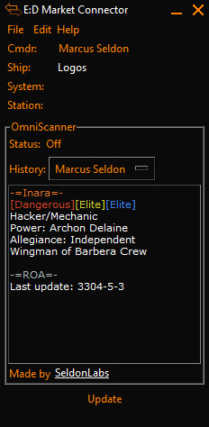
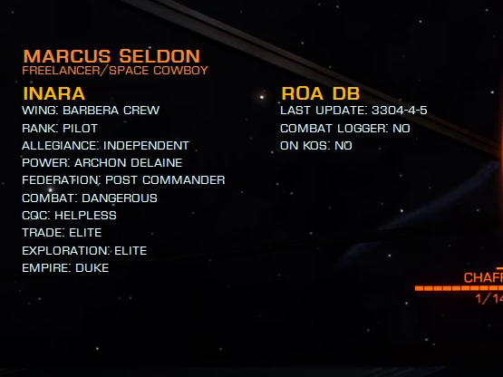

# OmniScanner (DEPRECATED - NOT SUPPORTED ANYMORE)
Omniscanner has been decomissioned.
~~An EDMC plugin for scanning commanders and getting their background info.~~

## About
OmniScanner is a plugin for scanning commanders and get their background profiles from [Inara][0] and from the [Ronin of Amarak (ROA) PVP Database][1].

## Usage
OmniScanner works only when another player is scanned (obviously), after the scan is complete you will receive any info found on Inara or on ROA DB.

**Only open mode is supported**, this plugin is **deactivated solo mode** and **private group mode**.

#### Example response in EDMC

##### Inara
- Red is for combat rank.
- Yellow is for trade rank.
- Blue is for exploration rank.
- Role in Inara database.
- Etc.

##### ROA
- Clan name (could differ from Inara).
- Last update shows when the record was updated for the last time.
- Combat Logger if the scanned commander is a know combat logger.
- Kill on Sight for people flagged by ROA.

#### Example response using EDMCOverlay

## Installation
- Run the the installer for the latest version.
- If you want to use the overlay you have to install [EDMCOverlay][3] too and enable `Use Overlay` in OmniScanner settings.
- Restart ED Market Connector and pray the [Great Attractor][2].

## Overlay limitations
- Supports only 64bit Elite:Dangerous (Horizons) on Windows only.
- No Apple support.
- "Windowed" or "Borderless Fullscreen" mode only, Fullscreen is not supported.

## Features
- Full [Inara][0] profile with public data.
- [ROA][1] profile with KOS and combat logging commanders.
- Customizable onscreen TTL (Time To Live) for the overlay.
- Customizable date format with normal UTC and Elite UTC (330x years).
- Automatic deactivation when deploying hardpoints.
- Commander tracking for combat loggers (highly experimental, not public).
- Customizable GUI and overlay through config file `omniscanner.ini`.
- Scanner history with the latest 15 scans, you can configure the history length by changing the parameter `log_len` in `omniscanner.ini`.

## Customization
- `log_len`: the length for the history log, you shouldn't use a value higher than 50 to avoid the GUI to start acting funny, default is 15.
- `width`: The width of the output text area for the EDMC GUI, default is 30,
- `height`: The height of the output text area for the EDMC GUI, default is 15.
- `font`: Font type for the output text area.
- `size`: Font size for the output text area.

## Commander Tracking
As an **experimental feature**, if you scan a commander that is flagged by ROA DB as **Combat Logger** or is in ROA **KOS list**, the position of the scanned commander will be logged and saved until another commander will update that entry with another scan.

Being an experimental feature these info will not be usable for now but only used for testing and see how it goes with a small/medium userbase.

## Versions
- 0.4.0: Add EDMC Gui and multiple improvements.
- 0.3.0: Add status message on EDMC panel.
- 0.2.1: Update EDMCOverlay version.
- 0.2.0: Customizable configuration for overlay.
- 0.1.1: Add startup message with version check.
- 0.1.0: Initial testing version.

## Contacts
- Twitter: https://twitter.com/MarcusSeldon

## Thanks
- To Cmdr Artie for [Inara][0].
- To Cmdr Lou Baron for access to the [ROA DB][1].
- To Ian Norton for [EDMCOverlay][3].

[0]:https://inara.cz
[1]:http://roaweb20161109100616.azurewebsites.net/
[2]:https://en.wikipedia.org/wiki/Great_Attractor
[3]:https://github.com/inorton/EDMCOverlay
